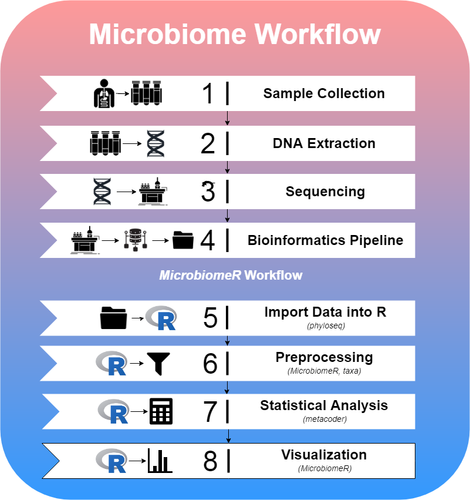

# Summary

The term “microbiome” refers to the microbial community in a given environment. In particular, it has recently risen to prominence in medicine to refer to the human oral, skin, urogenital, and digestive tract commensal bacterial communities. Modern technologies allow for the characterization of microbiome composition by high-throughput sequencing of 16S ribosomal DNA that effectively serves as identifying “bar codes”. Research studies focus on comparing differences in microbiomes between environments or changes within environments over time. To ensure study rigor and reproducibility it is important that data processing be clearly described and standardized. This package aims to unify the processing, analysis, and visualization tools necessary for modern microbiome studies under a transparent and straightforward implementation that facilitates standardization in analysis and reporting.

Previous open source microbiome packages available for R [@r-core] (e.g. **vegan** and **microbiome**) have been developed, but lack the functionality afforded to more modern tools including **phyloseq** [@phyloseq] and **metacoder** [@metacoder]. Both of these packages, however, provide different degrees of functionality as it relates to data wrangling, statistical methods, and visualization.  Phyloseq, for instance, relies on **base** R functions such as _subset_ to extract or manipulate data, while metacoder uses a more modern approach like the **tidyverse**. Additionally, metacoder is built on top of the **taxa** package and uses a _“taxmap object”_, which allows for direct manipulation of hierarchical taxonomic data and associated application-specific data [@taxa].  Phyloseq, on the other hand, provides an excellent means for importing data into R as a _“phyloseq object”_, which can be used with various proven methods for analysis.  In order to bridge the gap, we have developed **MicrobiomeR**, to provide new tools and a comprehensive workflow based on concepts found in the phyloseq package and newer technologies being developed in the metacoder package.

# Workflow

The paradigm for studying the microbiome follows the steps shown in the figure below.  MicrobiomeR covers the last four steps of this workflow.

MicrobiomeR provides users with raw output files from the NIH’s Nephele pipeline.  This data was generated by the Illumina MiSeq workflow followed by the **Qiime** [@qiime] 16S pipeline for pair ended FASTQ files.  To begin a MicrobiomeR workflow, raw data files are imported into R as a phyloseq object, using the *create_phyloseq()* function.  While discouraged, the data can be manipulated directly using any of phyloseq’s methods.  Next, the data is converted to a taxmap object using the *create_taxmap()* function.

By conceptually modeling MicrobiomeR’s data preprocessing functions after phyloseq, we are able to enhance the useful microbiome analysis capabilities of metacoder and taxa by providing simple “phyloseq-style” preprocessing functions, which are critical for reducing noise within the data. Many of the **_filter()* functions are used for this purpose.  Additionally, any of the metacoder or taxa functions can be incorporated into the preprocessing steps as MicrobiomeR primarily operates on taxmap objects.

After preprocessing the data, statistical analysis can be conducted using MicrobiomeR’s formatting functions (*as_\*_format()*), which incorporate metacoder’s *calc_\*()* and *compare_groups()* functions. Furthermore, MicrobiomeR offers a unique _permanova()_ function, which quantifies multivariate community-level differences between groups.  Following statistical analysis, alpha and beta diversity can be visualized using the *alpha_diversity_plot()* and *ordination_plot()* functions, which are helpful for understanding the intra-sample differences (evenness and richness) and the inter-group differences. Other publication-ready visualizations can also be created using *heat_tree_plots()*, *correlation_plots()*, *stacked_barplot()*, and *top_coefficients_barplot()*.

# Utilities

One of the key advantages in using MicrobiomeR is its “phyloseq-style” filtering functions.  These functions are heavily dependent upon formatting and validation checkpoints to ensure that the proper data is being manipulated.  In Table 1, we describe the “MicrobiomeR formats” used throughout the package and how they are related to phyloseq, metacoder, and each other.

### Table 1:
| Name | Description | Data Tables |
|:--------------------:|:------------------------------------------------------------------------------------------------------------------------------------------------------------------------:|:--------------------------------------------------------:|
| PhyloseqFormat | A taxmap object that has just been converted from a phyloseq object with the create_phyloseq() function.  The observation tables represent the phyloseq::otu_table(), phyloseq::tax_table(), phyloseq::sample_data(), and phyloseq::phy_tree(). | otu_table tax_data sample_data phy_tree |
| Raw Format | A taxmap object that has been processed with the as_raw_format()function.  The otu_table and tax_data observation table from the "phyloseq_format” are renamed. | phyloseq tables otu_abundance otu_annotations |
| BasicFormat | A taxmap object that has been processed with the as_basic_format() function.  This format is defined by observation data that has been processed with the metacoder::calc_*_() functions. | raw tables taxa_abundance otu_proportions taxa_proportions |
| AnalyzedFormat | A taxmap object that has been processed with the as_analyzed_format() function.  This format is defined by observation data that has been processed with the metacoder::compare_groups() function. | basic tables statistical_data stats_tax_data |

Validation is performed internally by most of the preprocessing, analysis, and formatting functions, but it can also be done directly by using the *is_\*_format()* functions.  Furthermore, it is encouraged to explore the taxmap objects in order to view observation and taxonomy data.  Other MicrobiomeR utilities include project management tools for creating and organizing output directories for plots, a set of color palette functions based on *grDevices::colorRampPalette()*, and a taxonomic data parsing function called *parse_taxonomy_silva_128()* used to import data annotated by the SILVA [@silva_1] [@silva_2] database as a phyloseq object.

# Acknowledgments

The data in this R package was generated by the University of Mississippi Medical Center’s Genomics Core and further analyzed using the Nephele platform from the National Institute of Allergy and Infectious Diseases (NIAID) Office of Cyber Infrastructure and  Computational Biology (OCICB) in Bethesda, MD.

MicrobiomeR is currently being used to analyze microbiome data in a study conducted by Xiao Zhang, and enabled by Dr. Eric Vallender.

# References
