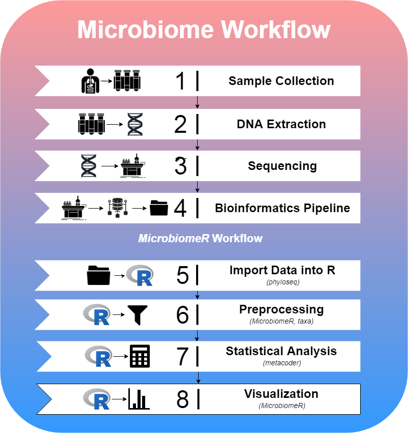

# Summary

As interest in microbiome studies grows, rapid changes occur in the data and tools used for analysis. While other open source microbiome packages available for R [@r-core] such as vegan and microbiome are useful, we’ve found that phyloseq [@phyloseq] and metacoder [@metacoder] offer the best analysis functions. All of the R packages dedicated to microbiome analysis provide different degrees of functionality as it relates to data wrangling, statistical methods, and visualization.  Phyloseq, for instance, relies on base R functions such as subset to extract or manipulate data, while metacoder uses a more modern approach like the tidyverse. Additionally, metacoder is built on top of the taxa package and uses a “taxmap object”, which allows direct manipulation of hierarchical taxonomic data and associated application-specific data [@taxa].  Phyloseq, on the other hand, provides an excellent means for importing data into R as a “phyloseq object”, which can be used with various proven methods to analyze it.  In order to bridge the gap, we have developed MicrobiomeR, which provides new tools and a comprehensive workflow based on concepts found in the phyloseq package and newer technologies being developed in the metacoder package.

# Workflow

The paradigm for studying the microbiome follows the steps shown in the figure below.  MicrobiomeR covers the last four steps of this workflow.

MicrobiomeR provides users with raw output files from the NIH’s Nephele pipeline.  This data was generated by the Illumina MiSeq workflow followed by the Qiime [@qiime] 16S pipeline for pair ended FASTQ files.  To begin a MicrobiomeR workflow, raw data files are imported into R using the *create_phyloseq()* function, which converts the data to a phyloseq object, and while discouraged, the data can be manipulated directly using phyloseq functions.  Next, the data is converted directly to a taxmap object using the *create_taxmap()* function.  

By conceptually modeling MicrobiomeR’s data preprocessing functions after phyloseq, we are able to enhance the useful microbiome analysis capabilities of metacoder and taxa by providing simple “phyloseq-style” preprocessing functions, which are critical for reducing noise within the data. Many of the **_filter()* functions are used for this purpose.  Additionally, any of the metacoder/taxa functions can also be incorporated into the preprocessing steps, since MicrobiomeR primarily operates on taxmap objects.

After preprocessing the data, statistical analysis can be conducted using MicrobiomeR’s formatting functions (*as_\*_format()*), which incorporate metacoder’s *calc_\*()* and *compare_groups()* functions. Furthermore, MicrobiomeR offers a unique _permanova()_ function, which quantifies multivariate community-level differences between groups.  Following statistical analysis, alpha and beta diversity can be visualized using the *alpha_diversity_plot()* function, which uses the Shannon Diversity Index as the default measure and *ordination_plot()* function.  This package also boasts other versatile and publication-ready visualization functions including *heat_tree_plots()*, *correlation_plots()*, *stacked_barplot()*, and *top_coefficients_barplot()*.

# Formatting and Validating Data

One of the key advantages in using MicrobiomeR is its “phyloseq-style” filtering functions.  These functions are heavily dependent upon formatting and validation checkpoints to ensure the proper data is being manipulated.  In Table 1, we describe the “MicrobiomeR formats” used throughout the package and how they are related to phyloseq, metacoder, and each other.

### Table 1:
| Level | Name | Description | Data Tables | Other Notes |
|:-----:|:--------------:|:--------------------------------------------------------------------------------------------------------:|:----------------------------------------------------------:|:---------------------------------------------------------------------------------------------------------------------------------------------------------------------------:|
| 0 | PhyloseqFormat | A taxmap object that has just been converted from a phyloseq object with the create_phyloseq() function. | otu_table tax_data sample_data phy_tree | The observation tables represent the phyloseq::otu_table(), phyloseq::tax_table(), phyloseq::sample_data(), and phyloseq::phy_tree(), data in the original phyloseq object. |
| 1 | Raw Format | A taxmap object that has been processed with the as_raw_format()function. | phyloseq tables otu_abundance otu_annotations | The new observation tables are just name conversions of the otu_table and tax_data table from the "phyloseq_format”. |
| 2 | BasicFormat | A taxmap object that has been processed with the as_basic_format() function. | raw tables taxa_abundance otu_proportions taxa_proportions | This format is defined by observation data that has been processed with the metacoder::calc_*_() functions. |
| 3 | AnalyzedFormat | A taxmap object that has been processed with the as_analyzed_format() function.. | basic tables statistical_data stats_tax_data | This format is defined by observation data that has been processed with the metacoder::compare_groups() function. |

Validation is performed internally by most of the preprocessing, analysis, and formatting functions, but it can also be done directly by using the *is_\*_format()* functions.  The taxmap objects can also be explored in order to view observation and taxa data.

Other utilities include project management tools.  Several functions help create output directories, while others help save the plots that are generated throughout the package.  MicrobiomeR also contains a set of color palette functions, which are based of the *grDevices::colorRampPalette()* function.  We also include a phyloseq style taxonomic data parsing function called *parse_taxonomy_silva_128()*, which is used to import data annotated by the SILVA [@silva_1] database.

# Acknowledgments

The data in this R package was generated by the University of Mississippi Medical Center’s Genomics Core and further analyzed using the Nephele platform from the National Institute of Allergy and Infectious Diseases (NIAID) Office of Cyber Infrastructure and  Computational Biology (OCICB) in Bethesda, MD.

# References
